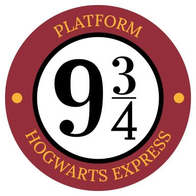

# 🧙‍♂️Кто ты из Гарри Поттера? - Бот-викторина в Telegram


Добро пожаловать в репозиторий Telegram-бота "Кто ты из Гарри Поттера?"! Этот бот — интерактивная викторина, которая поможет пользователям определить, на какого персонажа из вселенной Гарри Поттера они больше всего похожи, ответив на ряд вопросов.

✨ О проекте
Бот предлагает пользователю серию вопросов с вариантами ответов. Каждый вариант ответа связан с определенными персонажами и приносит им баллы. По завершении теста бот анализирует набранные баллы и определяет персонажа, который наиболее соответствует ответам пользователя, предоставляя его описание и изображение.

Ключевые особенности:
1. Интерактивный тест: Динамическая подача вопросов и вариантов ответов.

2. Персонализированные результаты: Определение персонажа на основе ответов пользователя.

3. Описание и изображение персонажа: Каждый результат сопровождается кратким описанием и соответствующим изображением.

4. Легкая настройка: Вопросы, варианты ответов и персонажи с их характеристиками хранятся в JSON-файлах, что позволяет легко изменять и расширять контент без редактирования кода.

5. Кнопки быстрого доступа: Возможность начать тест, получить информацию об авторе и поддержать проект.

🚀 Как запустить бота
Для запуска бота вам потребуется Python 3.8+ и pip для установки зависимостей.

1. Клонирование репозитория
Сначала клонируйте этот репозиторий на ваш локальный компьютер:

2. Установка зависимостей
Перейдите в корневую папку проекта (где находится bot.py) и установите необходимые библиотеки:

pip install -r requirements.txt
Если файла requirements.txt нет, создайте его со следующим содержимым:

python-telegram-bot==21.3
python-dotenv==1.0.0
И затем запустите pip install -r requirements.txt.

3. Настройка токена Telegram бота
Получите токен API вашего Telegram бота (например, через @BotFather).
Затем создайте файл с именем .env в корневой папке вашего проекта (potter_bot/) и добавьте в него ваш токен:

BOT_TOKEN=ВАШ_ТОКЕН_БОТА
(Замените ВАШ_ТОКЕН_БОТА на токен, который вы получили.)

4. Подготовка медиа-файлов (изображений)
Убедитесь, что все изображения, указанные в character_results.json (harry.jpg, hermione.jpg и т.д.), а также welcome.jpg находятся в папке assets/. Если этой папки нет, создайте её:

```potter_bot/
├── .env
├── bot.py
├── character_results.json
├── questions.json
├── requirements.txt
├── assets/
│   ├── welcome.jpg
│   ├── donate_qr.png
│   ├── bellatrix.jpg
│   ├── dobby.jpg
│   ├── draco.jpg
│   ├── dumbledore.jpg
│   ├── hagrid.jpg
│   ├── harry.jpg
│   ├── hermione.jpg
│   ├── luna.jpg
│   ├── ron.jpg
│   ├── snape.jpg
│   ├── umbridge.jpg
│   └── voldemort.jpg```

Важно: Убедитесь, что имена файлов изображений в character_results.json точно совпадают с именами файлов в папке assets/ (включая расширение и регистр букв).

5. Запуск бота
После всех настроек вы можете запустить бота из корневой папки проекта (potter_bot/):

python bot.py
Бот начнет работать, и вы увидите сообщение в консоли: "Бот запущен.".

⚙️ Настройка вопросов и персонажей
Все вопросы, варианты ответов и информация о персонажах хранятся в двух JSON-файлах:

questions.json: Содержит массив объектов вопросов. Каждый вопрос имеет поле question (текст вопроса) и options (массив вариантов ответа). Каждый вариант ответа имеет text (текст кнопки) и scores (объект, где ключи - имена персонажей, а значения - очки, начисляемые этому персонажу за данный ответ).

Пример структуры questions.json:

JSON

[
  {
    "question": "Что ты предпочитаешь в свободное время?",
    "options": [
      {"text": "Читать книги", "scores": {"Гермиона Грейнджер": 2, "Дамблдор": 1}},
      {"text": "Гулять на природе", "scores": {"Хагрид": 2, "Луна Лавгуд": 1}}
    ]
  }
]
character_results.json: Содержит объект, где ключи - имена персонажей, а значения - объекты с их характеристиками. Каждый объект персонажа должен содержать type (например, "positive", "negative", "complex"), description (текст описания результата), name (полное имя персонажа, используемое в выводе) и image (имя файла изображения персонажа).

Пример структуры character_results.json:

JSON

{
  "Гарри Поттер": {
    "type": "positive",
    "description": "Ты смелый и готов бороться за правду.",
    "name": "Гарри Поттер",
    "image": "harry.jpg"
  }
}
Важно: После любых изменений в этих JSON-файлах или в файле bot.py, обязательно перезапустите бота, чтобы изменения вступили в силу.

🤝 Вклад
Если у вас есть идеи по улучшению, предложения или вы нашли ошибку, не стесняйтесь открывать Issues или создавать Pull Requests. Ваш вклад приветствуется!

📜 Лицензия
Этот проект распространяется под лицензией MIT. Подробности см. в файле LICENSE (если у вас есть такой файл, добавьте его).

👨‍💻 Об авторе
Сергей Сергиенко

Telegram: @space_ranger3209

GitHub: https://github.com/sergo100